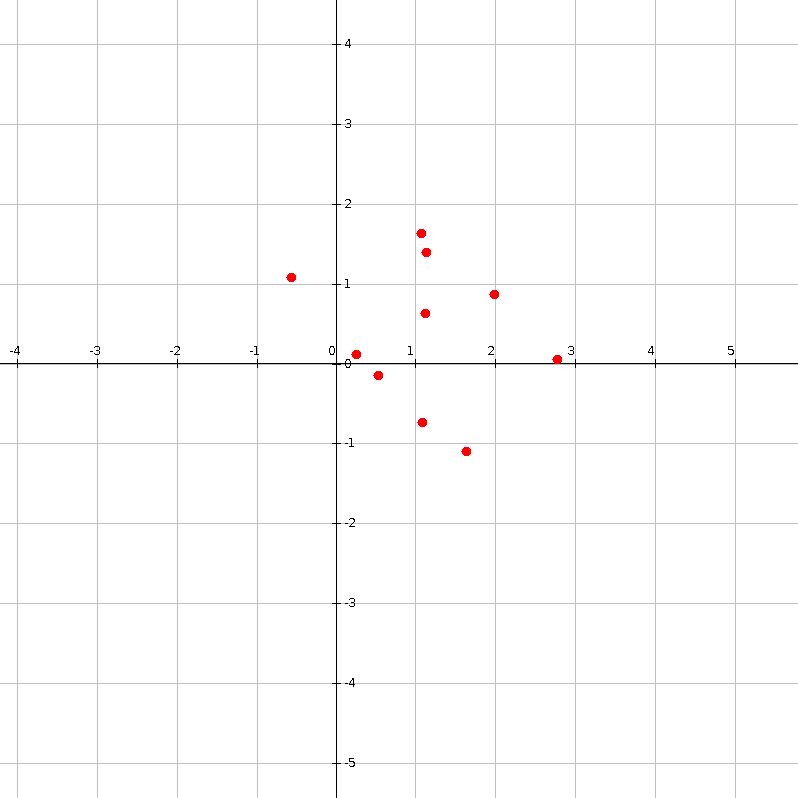
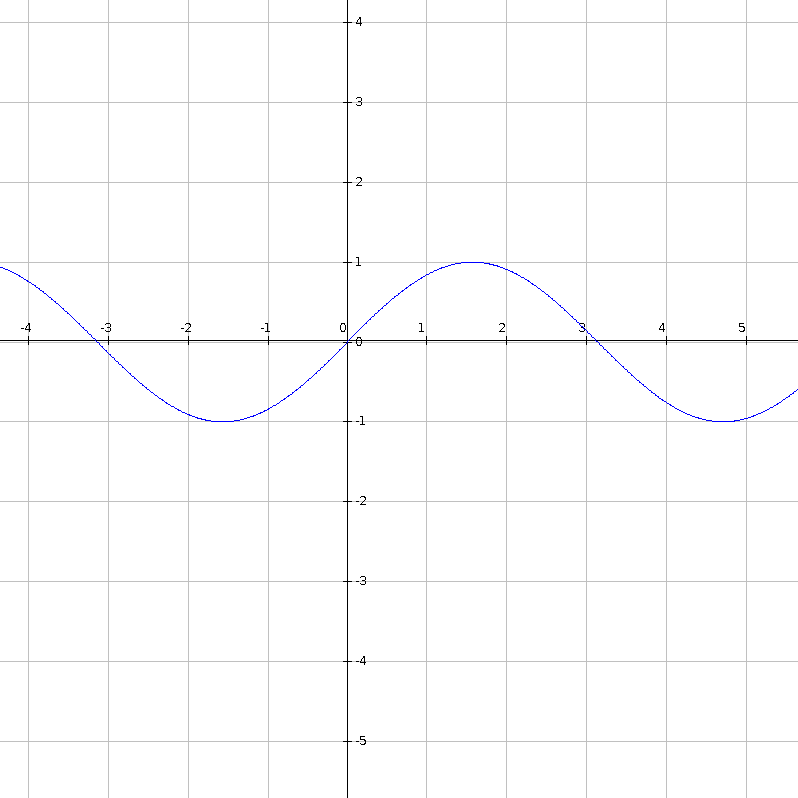
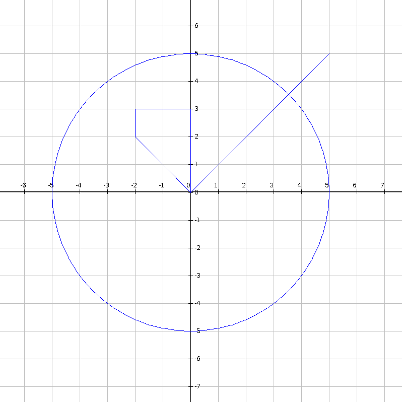

# Simple-2D-Graph-for-Java
Simple 2D graph implemented in Java. 

This project provides a simple 2D graph implementation for Java. 
The purpose of this project is not to create a high quality, optimal 2D graph implementation,
but a simple tool for quickly plotting points, functions and/or shapes. 

## Usage
In order to use the SimpleGraph implementation download the .jar file from the compiled folder and include it in your project. 
There are two usage examples in the main package. 
One demonstrates the graph functionality and the other demonstrates how to use the graph as part of a Swing application. 

You can easily create a graph with: 
```
SimpleGraph graph = new SimpleGraph();
```
and display it with
```
graph.display();
```

By using SimpleGraph you can plot points, 



functions and



shapes.



All of this is done by simple method calls such as: 
```
//Point
graph.addPoint(x, y);
//Function
graph.addFunction(x->Math.sin(x));
//Shape
graph.addShape(new SimpleGraph.Line(0, 0, 5, 5, Color.BLUE));
graph.addShape(new SimpleGraph.Circle(0, 0, 5, Color.BLUE));
```

Once displayed the graph is interactive and allows:
* moving in the plotted plane (hold left click and drag)
* zooming in and out (mouse wheel)

The graph also offers a right click menu which gives access to the following functionality: 
* showing or hiding the grid
* showing or hiding the ticks on the axises
* enabling adding points to the graph
* changing graph settings such as: 
    * changing the maximum visible span of the x axis
    * changing the maximum visible span of the y axis
    * changing the step of the x axis
    * changing the step of the y axis
    * changing the size of diplayed points
* saving the graph to a .png file
